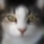
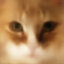
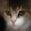
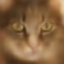

# simple variational autoencoder trained on images of cats using mygrad!

<div align="center">
  <strong><big>examples of generated images</big></strong><br/><br/>
  
  
  
  
</div>

##

## to build:

### <ins>requirements</ins>: cmake 3.14+, c++20+

### macos / linux:

```bash
cmake . -B build -DCMAKE_BUILD_TYPE=Release 
cmake --build build
```

### windows (visual studio):
```bat
:: Open "x64 Native Tools Command Prompt for VS"

cmake -S . -B build -DCMAKE_BUILD_TYPE=Release -G "NMake Makefiles"
cmake --build build
```

## dataset:

### you don't have to download anything to generate new images, so just skip this step if generating images is all you want.

if, however, you want to train the model or look at how it reconstructs images, download the [dataset](https://www.kaggle.com/datasets/borhanitrash/cat-dataset) as zip, unpack it into `mygrad/examples/cats/` (where this readme is located), and rename the directory with the dataset to be catsData: 
```
mv cats catsData
```

## to run:

```
cd build 
./cats <train|reconstruct|generate [amountOfImages]>
```
